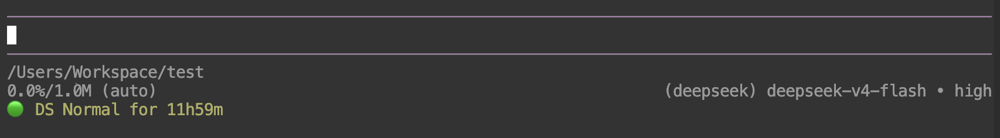

# pi-deepseek-peak

Pi extension that shows DeepSeek peak hours in the TUI status bar.



DeepSeek API pricing varies by time of day. Peak hours are more expensive. This extension adds a persistent status indicator so you know when you are in a peak window.

## Features

- Status bar indicator: "DS Peak" or "DS Normal"
- Follows DeepSeek's billing windows exactly: peak Mon-Fri 01:00-04:00 and 06:00-10:00 UTC; weekends (Sat/Sun Beijing time) are off-peak all day
- Countdown to the next price change next to the dot (on by default, toggle via `/dsp-countdown`): "DS Peak for 1h30m", "DS Normal for 27h"
- Auto-refresh at a configurable interval (30s / 1m / 5m, default 5m) via `/dsp-refresh`
- Correct DeepSeek V4 session pricing: each assistant reply's stored cost is patched at write time with the rate in effect when it completed (peak or off-peak), and `/dsp-cost` recomputes the whole session (peak/off-peak split, per model)
- Uses theme colors (warning for peak, success for normal)
- Thats it

## Install

```sh
pi install npm:pi-deepseek-peak
```

Restart pi or run `/reload` to activate.

## Usage

Once installed, the status bar shows the current DeepSeek pricing period.

### Real session cost

Every DeepSeek V4 assistant reply is priced at the rate in effect when the request completed (peak/off-peak), and the stored cost is corrected at write time — so pi's footer and `/session` cost totals already reflect the real price. To see the full breakdown:

```sh
/dsp-cost
```

It recomputes the whole session from the stored messages (model and timestamp per message), so it is correct even for sessions resumed from disk. Output:

- Current-period rates for both models (`DS Peak: flash in $0.44/M (hit $0.014) out $1.32/M · pro in $1.32/M (hit $0.044) out $3.96/M`)
- `Total $X (peak $A / off-peak $B)`
- Per-model token and cost lines
- A note when any message had a model outside the rate table (e.g. legacy `deepseek-chat`): those keep pi's bundled cost

DeepSeek's official rates (https://api-docs.deepseek.com/quick_start/pricing/): peak $0.44 input / $0.014 cache hit / $1.32 output per 1M tokens for flash, $1.32 / $0.044 / $3.96 for pro; off-peak is exactly half.

> **Note:** `/session` and the footer display the stored costs — correct for messages created after this extension was activated, but messages from before (or from a resumed session) keep pi's old flat-rate cost there. `/dsp-cost` is the only view that recomputes everything.

### Countdown to the next price change

Show how long until the green/red dot flips (e.g. red peak until 04:00 UTC). The menu offers on/off:

```sh
/dsp-countdown    # pick on or off from a menu
```
enable: "🔴 DS Peak for 1h30m"
disable: "🔴 DS Peak"

The remaining time is colored with the current state (red while peak, green while off-peak) and refreshes with the same status check. The setting is saved to `~/.pi/agent/deepseek-peak.json`.

### Auto-refresh interval

How often the status indicator refreshes. No value to type — a menu offers the three choices:

```sh
/dsp-refresh    # pick 30s, 1m or 5m from a menu
```

The current interval is shown in the picker title; pick another anytime to switch. The choice is saved to `~/.pi/agent/deepseek-peak.json` (`refresh`, in seconds, default 300) and applies immediately.

### Auto-refresh interval

How often the status indicator refreshes. No value to type — a menu offers the three choices:

```sh
/dsp-refresh    # pick 30s, 1m or 5m from a menu
```

The current interval is shown in the picker title; pick another anytime to switch. The choice is saved to `~/.pi/agent/deepseek-peak.json` (`refresh`, in seconds, default 300) and applies immediately.

The config file `~/.pi/agent/deepseek-peak.json` stores `{ "countdown": true, "refresh": 300 }` and persists across restarts.

## How it works

On session start, the extension computes the current DeepSeek pricing period and displays either "DS Peak" or "DS Normal" in the pi status bar. A timer refreshes the indicator at the configured interval (default every 5 minutes, adjustable via `/dsp-refresh`).

Billing rule (https://api-docs.deepseek.com/quick_start/pricing/): peak hours are 01:00-04:00 and 06:00-10:00 **UTC**, Monday through Friday. All other hours are off-peak, and weekends (Saturdays and Sundays, Beijing time) are off-peak all day. Since the windows are UTC-based, the indicator is the same for every timezone.

When the countdown option is on, the time until the next status change is shown next to the dot, e.g. "🟢 DS Normal for 27h" on a weekend day (next peak starts Monday 01:00 UTC).

The same peak/off-peak rule drives pricing: the extension patches each DeepSeek V4 assistant message's stored cost at `message_end` with the rate in effect at completion, and `/dsp-cost` recomputes the full session history.

## Testing an unpublished branch

To test a local branch (e.g. `feat/[branch_name]`) before publishing:

```sh
# from the repo on your host machine
git checkout feat/[branch_name]
```

### With pi installed locally

```sh
pi install /absolute/path/to/pi-deepseek-peak
```

This replaces the published npm version (no need to uninstall it first). Then `/reload` (or restart pi). 
To switch back to the released version:

```sh
pi install npm:pi-deepseek-peak
```

and `/reload` again.

### When pi runs inside a Docker container

Copy the branch into the running container, then install from there:

```sh
docker cp . <container-name>:/tmp/pi-deepseek-peak
```

Run the following inside the container's pi:

```sh
pi install /tmp/pi-deepseek-peak
```

If a previously installed copy of this extension is still active (e.g. an old npm/git source), remove it :

```sh
pi list          # see the installed sources
pi remove git:github.com/psychobarge/pi-deepseek-peak
```

Then `/reload` to pick up the change.
To get back to the released version and set it as the only source:

```sh
pi install npm:pi-deepseek-peak
```

and `/reload`. Iterating often? Mount the repo as a Docker volume (`-v ~/Workspace/Perso/pi-deepseek-peak:/app/pi-deepseek-peak ...`) and reinstall after each `git checkout` on the host.

## Changelog

See [CHANGELOG.md](CHANGELOG.md) for version history.

## License

MIT
